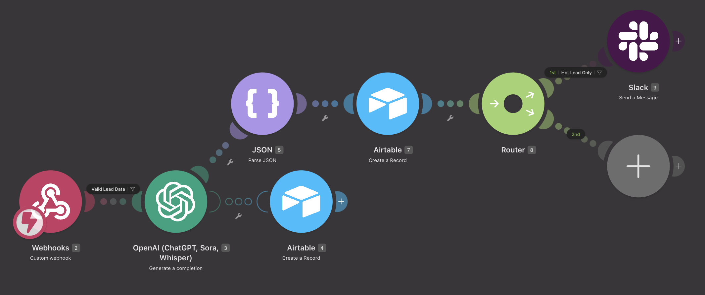
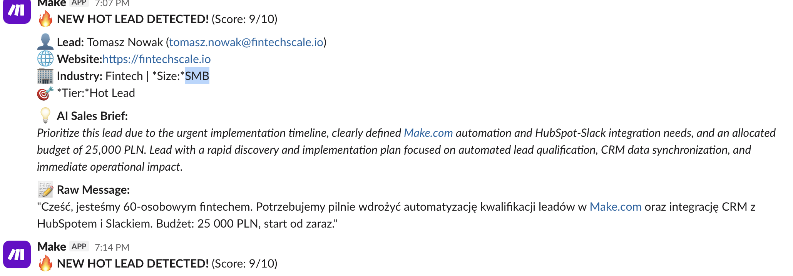

# ⚡ AI Lead Enrichment & Automated Qualification (Sell / CRM)

An event-driven, production-grade automation workflow engineered with **Make.com**, **OpenAI API (GPT-5o)**, **Airtable**, and **Slack**. 

This system ingests inbound leads in real time via secure webhooks, validates incoming payloads, enriches company data and scores buyer intent using LLMs in Strict JSON Mode, synchronizes structured records into an Airtable CRM, and routes high-priority opportunities straight to a sales Slack channel with actionable pitch summaries.

---

## 📸 System Previews

| Make.com Workflow Pipeline | Real-Time Slack Bot Notification |
| :---: | :---: |
|  |  |

---

## 🎯 Business Value & Key Metrics

* **Instant Speed-to-Lead (< 3s):** Replaces slow manual review with sub-3-second real-time scoring and instant alerts.
* **Higher Conversion Readiness:** Equips sales reps with pre-calculated firmographic insights (industry, company size, urgency) and tailored elevator pitches before the first touchpoint.
* **0 Idle Cost Architecture:** Replaces polling schedules with real-time webhooks, drastically reducing automation operation consumption.
* **Zero Lost Opportunities:** Guarantees data persistence in CRM even during third-party API downtimes.

---

## 📐 Architecture Diagram

```text
                                  ┌────────────────────────┐
                                  │ Drop / Reject Payload  │
                                  └────────────────────────┘
                                               ▲
                                               │ (Invalid Email / Bot Pattern)
┌────────────────┐      ┌────────────────┐  ┌──┴──┐      ┌────────────────┐      ┌────────────────┐
│  Inbound Lead  │─────►│ Custom Webhook ├─►│Guard├─────►│  OpenAI GPT-4o │─────►│   JSON Parser  │
│ (Website Form) │      │  (POST Ingest) │  └─────┘      │  (JSON Mode)   │      │(Schema Flatten)│
└────────────────┘      └────────────────┘               └───────┬────────┘      └───────┬────────┘
                                                                 │ (API Outage)          │
                                                                 ▼                       │
                                                        ┌─────────────────┐              ▼
                                                        │ Never-Lose-Lead │      ┌────────────────┐
                                                        │ Raw Lead Ingest │      │ Airtable CRM   │
                                                        │ (Fallback State)│      │(Enriched Lead) │
                                                        └─────────────────┘      └───────┬────────┘
                                                                                         │
                                                                                         ▼
                                                                                 ┌───────────────┐
                                                                                 │ Router/Filter │
                                                                                 └───┬───────┬───┘
                                                                                     │       │
                                                      (Lead Score >= 8: Hot) ────────┘       └────── (Score < 8: Warm/Cold)
                                                      │                                              │
                                                      ▼                                              ▼
                                           ┌──────────────────────┐                         [Stored in CRM Only]
                                           │ Slack #hot-leads     │
                                           │ (Rich Instant Alert) │
                                           └──────────────────────┘
```

---

## 🛡️ Enterprise Resilience & Fault Tolerance

* **Payload Guard Filter:**
  * Validates incoming email format via Regex (`^[\w-\.]+@([\w-]+\.)+[\w-]{2,}$`) and checks payload integrity before triggering AI modules, eliminating spam and bot executions.

* **Strict JSON Schema Enforcement:**
  * Uses OpenAI JSON Object response formatting with explicit schema constraints to guarantee 100% deterministic field parsing.

* **"Never Lose a Lead" Fallback Pattern:**
  * Dedicated Error Handler captures 5xx/429 OpenAI API exceptions and automatically records the raw lead into Airtable with a fallback flag, ensuring zero data loss during third-party outages.

* **Targeted Slack Alert Routing:**
  * Filters alerts to notify sales teams only when `lead_score >= 8`, eliminating notification fatigue.

---

## 🛠️ Technology Stack

| Component | Technology | Role |
| :--- | :--- | :--- |
| **Orchestration** | [Make.com](https://www.make.com/) | Webhook ingestion, JSON parsing, routing, error handlers |
| **Intelligence** | [OpenAI API](https://platform.openai.com/) | Firmographic extraction, intent scoring, sales brief generation |
| **CRM / Data Layer**| [Airtable](https://airtable.com/) | Real-time state management, lead profiling |
| **Team Alerts** | [Slack API](https://slack.com/) | Formatted markdown alerts to dedicated `#hot-leads` channel |

---

## 🤖 AI Prompt Engineering

### System Prompt
```text
You are an expert Sales Development Representative and Lead Qualification Specialist. 
Analyze incoming B2B lead information and return a single valid JSON object.

Extract and infer:
1. "industry": Best-guess industry based on website/message (e.g. "Fintech", "Manufacturing", "E-commerce", "Unknown").
2. "company_size": Estimate ("Startup", "SMB", "Mid-Market", "Enterprise").
3. "lead_score": Integer from 1 to 10 evaluating sales readiness, budget, and project urgency.
4. "sales_brief": Concise 2-sentence actionable summary advising the sales rep on how to pitch this lead.
5. "qualification_tier": Choose exactly one: "Hot Lead" (score 8-10), "Warm Lead" (score 5-7), or "Cold/Spam" (score 1-4).

Output ONLY raw JSON format matching this schema:
{
  "industry": "string",
  "company_size": "string",
  "lead_score": number,
  "sales_brief": "string",
  "qualification_tier": "string"
}
```

### User Prompt Input
```text
Name: {{2.name}}
Email: {{2.email}}
Website: {{2.website}}
Message: {{2.message}}
```

---

## 📋 Database Schema (Airtable)

| Field Name | Type | Description |
| :--- | :--- | :--- |
| `Lead Name` | Single line text | Full name of the contact |
| `Email` | Email | Contact email address |
| `Company Website` | URL | Prospect domain name |
| `Raw Message` | Long text | Raw inquiry from the website form |
| `Company Industry` | Single line text | Industry predicted by AI |
| `Company Size Estimate` | Single line text | Predicted company scale (`Startup`, `SMB`, `Enterprise`) |
| `Lead Score` | Number (Integer) | Score from 1 to 10 |
| `AI Sales Brief` | Long text | Actionable summary for sales outreach |
| `Qualification Tier` | Single select | `Hot Lead`, `Warm Lead`, `Cold/Spam`, `Enrichment Failed` |

---

## 🚀 Setup & Installation

* **Clone & Import:**
  * Clone this repository.
  * Import `blueprint.json` into your **Make.com** account.

* **Airtable Configuration:**
  * Create an Airtable base titled `Inbound Leads CRM` with the schema outlined above.
  * Authenticate your Airtable connection inside Make.com.

* **OpenAI & Slack Setup:**
  * Add your `OPENAI_API_KEY` to the OpenAI module.
  * Connect your Slack workspace and select the target alerts channel (e.g. `#hot-leads`).

* **Form Integration:**
  * Copy the webhook URL from the initial **Custom Webhook** module.
  * Point your website form submission handler (Webflow, Typeform, Custom React/Next.js API) to this URL via `HTTP POST`.

 ---

## 💼 Need Custom AI & Workflow Automation?

I build bespoke, enterprise-grade AI agents, CRM pipelines, and backend automations for fast-growing businesses.
* **Email:** automate.biau@gmail.com
